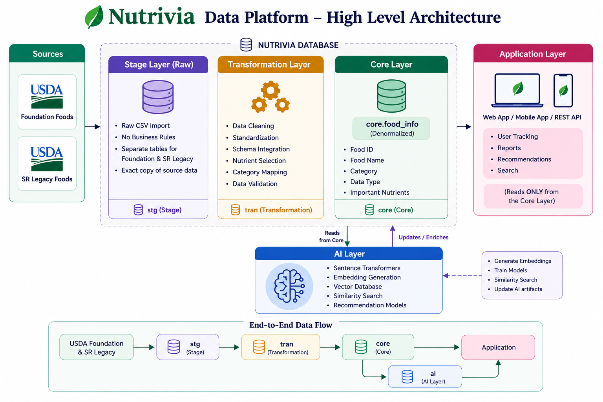
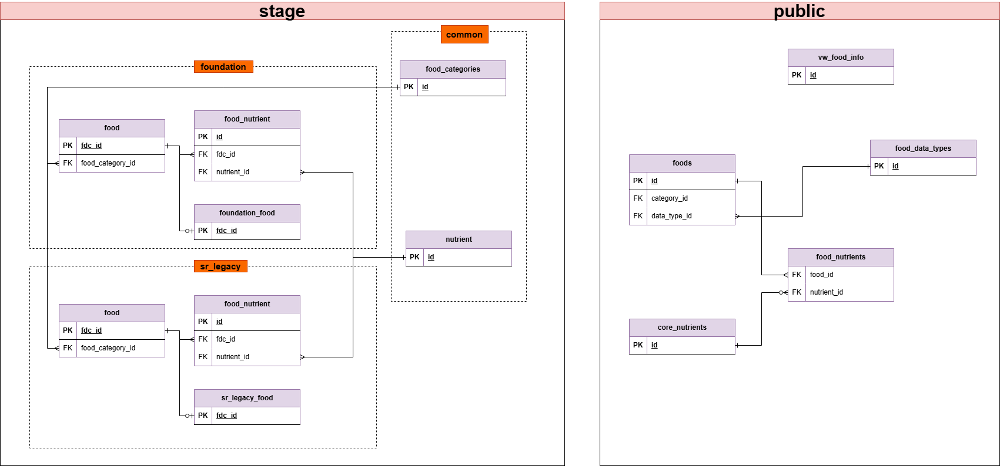

# Nutrivia Food Data Platform

A PostgreSQL data platform for integrating, cleaning, and serving USDA FoodData Central datasets.

This project is designed as the backend data foundation for Nutrivia, a nutrition application capable of food search, nutrition analysis, health reporting, and future AI-powered food recommendations.

---

## High-Level Architecture



This architecture shows the flow of data from raw USDA datasets through the staging and production layers to the application and analytics components.

---

## Database ER Diagram



The ER diagram shows the normalized relational schema, including primary key and foreign key relationships between core entities.

---

## Project Goals

The objective of this project is to transform raw USDA datasets into a clean, normalized, and scalable database suitable for real-world applications.

The platform focuses on:

- Data quality
- Data consistency
- Normalized schema design
- Scalable ETL pipelines
- Scalable database architecture

---

## Features

- Stage Layer for raw USDA data
- Public Layer for cleaned production data
- Views for simplified querying
- Stored Procedures for data loading (future)
- SQL Functions for querying (future)
- Nutrient Normalization (future)


---

## Tech Stack

| Technology | Purpose |
|------------|---------|
| PostgreSQL | Database |
| Supabase | Database Hosting |
| SQL | Data Processing |
| GitHub | Repository |

Future:

- FastAPI
- React
- pgvector
- AI Recommendation Engine

---

## Architecture

```
USDA CSV Files
        │
        ▼
 Stage Schema
(Raw Data Import)
        │
        ▼
Public Schema
(Clean Production Data)
        │
        ▼
Views
        │
        ▼
REST API
        │
        ▼
Frontend
```

---

## Data Sources

Currently supported datasets:

- Foundation Foods
- SR Legacy

Planned:

- Branded Foods
- Survey Foods
- Open Food facts

---

## Database Design

The database follows a normalized relational model.

Major entities include:

- Foods
- Nutrients
- Food Nutrients
- Categories
- Foundation Foods
- SR Legacy Foods

---

## Documentation

Detailed documentation is available inside the **docs** directory.

- Architecture
- Database Schema
- Data Pipeline

---

## Roadmap

- USDA complete integration
- Food search optimization
- Vector embeddings
- Semantic food search
- AI recommendations
- FastAPI backend
- React frontend
- User food logging
- Nutrition analytics
- Health reports

---
